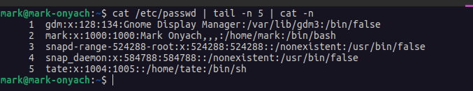

# Linux Fundamentals

## Navigation

`pwd`

/home/noble12

`ls`

Desktop Documents Downloads Music Pictures Public Templates Videos

`ls -l`

total 32
drwxr-xr-x 2 noble12 htbacademy 4096 Jan 12 23:22 Desktop

- N/B Total amount of blocks (512-byte) => 32 * 512 = 16384 bytes of disk space

`ls -la`

List all command - lists hidden files too such as __.bashrc__ or __.bash_history__

## Other useful ls commands

`ls -l /var/`

`cd /dev/shm`

`cd -`

`cd ..`

`cd shm && clear`

[CTRL] + [R] - Search through the command history by typing some of the text we are looking for

[CTRL] + [L] - Clear screen

[CTRL] + [U] - Clear command from last to first part

## Create, Move, and Copy

- Make dir

`mkdir dirname`

`mkdir -p dirname/dir1name`

- Rename a dir

`mv dirname dir2name`

- Create files

`touch filename`

- Create a file to a specific dir

`touch . dirname/filename`

cat: used to type out a file (or combine files).

`cat filename` -> view file content

`cat file1 file2` -> view both

`cat file1 file2 > file3` -> concat file1 & file2 to a new file3

head: used to show the first few lines of a file.

`head file1` -> 1st 10 lines if > 10 lines
`head -n 3` -> 1st 3 lines

- N/B - can be piped with both grep and filter

tail: used to show the last few lines of a file.

`tail file1` -> last 10 lines if > 10 lines
`tail -n 3` -> last 3 lines

`tail -n 3 /etc/passwd | cat -n`

`cat /etc/passwd | tail -n 3 | cat -n`

cut: view a portion of the file - using delimiters -d

`cut -d: -f2`
`cat /etc/passwd | cut -d: -f3` 

tr: transform

`tr ':' ' '`

`cat /etc/passwd | tr ':' ' '`

wc: word count -> w - words | c - characters | l - lines

`wc filename`
`wc -l filename`
`wc -c filename`
`wc -w filename`

`cat /etc/passwd | wc -l`
 

find
sed
grep
awk

man: used to view documentation.

man head | head

Most input lines entered at the shell prompt have three basic elements

Command
Options -p --print
Arguments

## Bash script

#!/bin/bash

echo Hello $whoami, your id: $id

## TODO: Variables 

name='James'

age=21

echo $age old me is older than $name

## TODO: Parameters

city=$1

state=$2

echo $1 $2 $3

## Get the number of supplied args

echo $#

#running the above
#./test.sh Alex Noble Grace

## TODO: read

echo What is your city:

read city

echo You belong to one of the best cities, $city

## arrays
#create

transport=('Bike', 'Car', 'Cycle')

#access the indices

echo "${transport[@]}"

#@ - all args
#[] - index

unset transport[2]

transport[2] = 'Plane'

## conditionals

[[]] or []
-eq -ne -gt -lt
if []
then
else
fi
